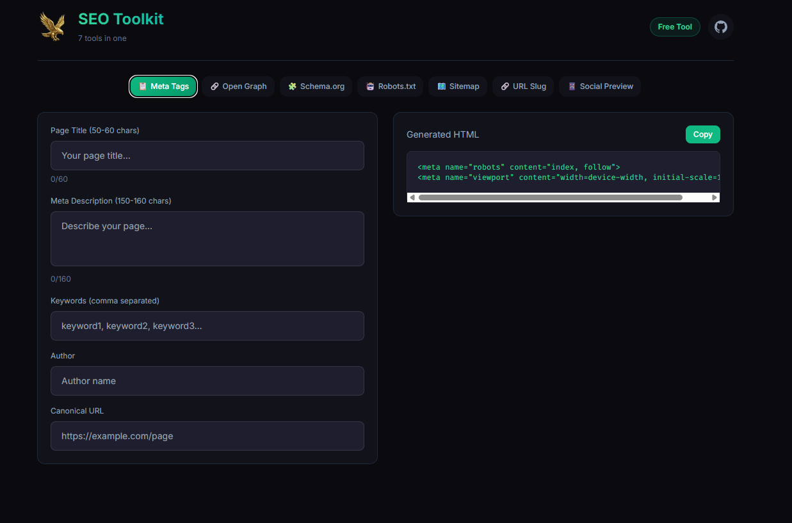

# 🦅 Elsakr SEO Toolkit

<div align="center">
  <a href="https://elsakr.company">
    
  </a>
</div>

> **Part of Elsakr Open Source Tools Ecosystem — [View All Tools](https://elsakr.company/tools)**  
> *7 SEO Tools in ONE. Get your SEO right from day 1. Rank higher.*

---

## ⭐ Badges


## 📋 Table of Contents
- [🦅 Elsakr SEO Toolkit](#-elsakr-seo-toolkit)
  - [⭐ Badges](#-badges)
  - [📋 Table of Contents](#-table-of-contents)
  - [🧐 What is it?](#-what-is-it)
  - [✨ Features](#-features)
  - [🚀 Installation \& Usage](#-installation--usage)
  - [🤝 Contributing](#-contributing)
  - [📜 License](#-license)
  - [📞 Contact](#-contact)
  - [🇪🇬 Arabic Version / النسخة العربية](#-arabic-version--النسخة-العربية)

---

## 🧐 What is it?
**Elsakr SEO Toolkit** is a suite of 7 essential tools for webmasters and marketers. It helps you generate Meta Tags, Open Graph data, Twitter Cards, Schema Markup (JSON-LD), Sitemaps, and robots.txt files. Everything you need for on-page SEO in one place.

## ✨ Features
- **Meta Generator**: Title, Description, Keywords.
- **Social Tags**: Open Graph (Facebook) & Twitter Cards.
- **Schema JSON-LD**: Structured data for Google Rich Snippets.
- **Sitemap/Robots**: File generators for indexing.
- **Analysis**: Basic checklist and verification.

## 🚀 Installation & Usage


1. **Clone**:
   ```bash
   git clone https://github.com/khalidsakrjoker/Elsakr-SEO-Toolkit.git
   ```
2. **Run**: Open `index.html`.
3. **Generate**: Fill forms and copy the HTML code to your site.

---

## 🤝 Contributing
SEO changes fast. If you see a missing tag or a new Google recommendation, update it!

## 📜 License
Distributed under the MIT License. See `LICENSE` for more information.

## 📞 Contact
**Elsakr Tools** - [elsakr.company](https://elsakr.company)  
*Open Source Tools with a Falcon’s Vision.*

---

# 🇪🇬 Arabic Version / النسخة العربية

# 🦅 Elsakr SEO Toolkit (حقيبة السيو)

<div align="center">
  <a href="https://elsakr.company">
    
  </a>
</div>

> **جزء من نظام صقر للأدوات مفتوحة المصدر — [عرض كل الأدوات](https://elsakr.company/tools)**  
> *7 أدوات SEO في واحد. ابدأ صح واتصدر البحث.*

---

## 🧐 ما هي هذه الأداة؟
مجموعة من 7 أدوات أساسية لأي مشرف موقع أو مسوق. بتساعدك تولد أكواد الميتا (Meta Tags)، بيانات السوشيال ميديا (Open Graph & Twitter)، الـ Schema Markup (JSON-LD)، خرائط الموقع (Sitemaps)، وملفات robots.txt. كل اللي محتاجه للـ On-Page SEO موجود هنا.

## ✨ المميزات
- **مولد الميتا**: العناوين، الوصف، والكلمات المفتاحية.
- **وسوم السوشيال**: لظهور ممتاز على فيسبوك وتويتر.
- **السكيما**: بيانات هيكلية عشان نتائج جوجل الغنية (Rich Snippets).
- **أدوات الفهرسة**: مولد Sitemaps و Robots.txt.
- **تحليل**: نقاط تحقق سريعة.

## 🚀 التثبيت والاستخدام
1. **نزل الملفات**: اعمل Clone للريبو.
2. **شغل**: افتح `index.html`.
3. **ولد**: املأ البيانات وانسخ الكود لموقعك.

## 📞 تواصل معنا
**أدوات صقر** - [elsakr.company](https://elsakr.company)  
*أدوات مفتوحة المصدر برؤية صقر.*
